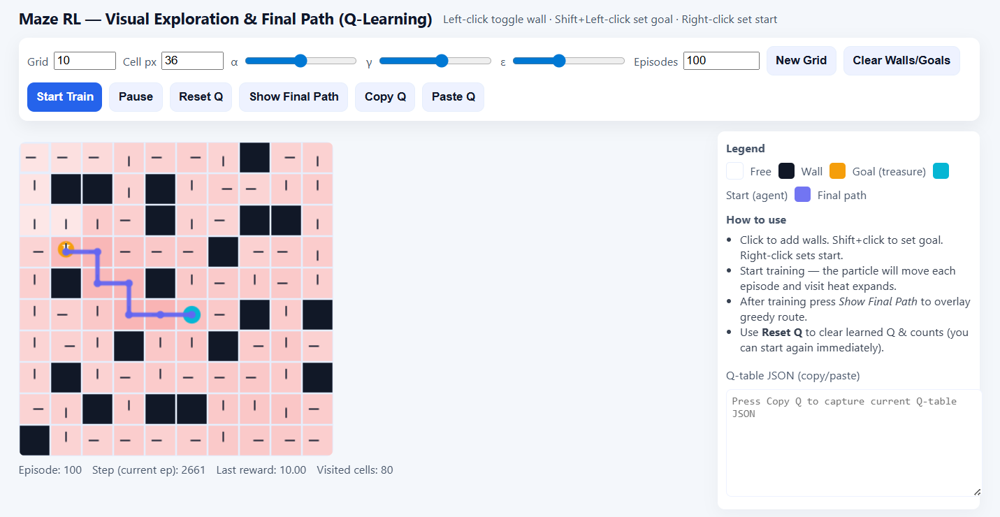

# 🧭 MazeRL: Interactive Q-Learning Maze Simulator

[](https://kshitijkasodkar.github.io/Maze-Reinforcement-Learning/)
[](https://opensource.org/licenses/MIT)

MazeRL is an elegant, interactive web-based visualization tool that brings **Q-Learning** to life in a grid-based maze environment. Design custom mazes, train an RL agent, fine-tune hyperparameters, and witness optimal paths emerge - all seamlessly within your browser.


---
## 🌐 Live Demo
Experience the fully interactive MazeRL simulator directly in your browser.  
👉 **Live here:** https://kshitijkasodkar.github.io/Maze-Reinforcement-Learning/
No installation required - pure client-side execution.




---

## 🚀 Overview

Dive into a comprehensive playground for mastering Reinforcement Learning with MazeRL:

* **Craft Custom Mazes**: Build environments tailored to your experiments.
* **Tune Q-Learning Parameters**: Adjust learning dynamics in real-time.
* **Visualize Learning**: Watch the agent evolve through animated exploration and heatmaps.
* **Export & Import**: Preserve and share Q-tables for advanced workflows.
* **Optimal Path Rendering**: Reveal the agent's learned policy with a single click.

Powered by pure client-side **JavaScript**, MazeRL requires no installation or backend—pure, premium interactivity at your fingertips.

---

## ✨ Features

### 🧱 Interactive Maze Builder
* **Left-click**: Toggle walls to shape your maze.
* **Shift + Left-click**: Designate the goal (treasure).
* **Right-click**: Position the start (agent).
* **Dynamic Sizing**: Customize grid and cell dimensions.
* **Responsive Canvas**: Adapts effortlessly to your screen.

### 🤖 Real-Time Q-Learning Engine
* **Hyperparameter Control**:
    * **$\alpha$ (Alpha)**: Learning rate for updates.
    * **$\gamma$ (Gamma)**: Discount factor for future rewards.
    * **$\varepsilon$ (Epsilon)**: Exploration-exploitation balance.
* **Flexible Training**: Run from quick tests to extensive sessions.
* **Granular Control**: Step through episodes, pause, resume, or halt anytime.
* **Live Updates**: Observe Q-table evolution in real-time.

### 🎬 Immersive Training Visualization
* **Animated Exploration**: See the agent navigate dynamically.
* **Visit Heatmaps**: Color-coded insights into cell frequencies.
* **Final Path Display**: Unveil the optimal greedy trajectory post-training.

### 📄 Advanced Q-Table Tools
* **Export Q-Table**: Copy as JSON for external use.
* **Import Q-Table**: Restore saved states seamlessly.
* **Reset Functionality**: Wipe Q-values and visit data for fresh starts.

---

## 🕹️ How to Use

### 1️⃣ Build Your Maze
* **Walls**: **Left-click** to erect barriers.
* **Goal**: **Shift + Left-click** to place the treasure.
* **Start**: **Right-click** to set the agent's origin.

### 2️⃣ Configure RL Settings
Fine-tune **Grid and Cell sizes**, **Episode count**, and the **$\alpha$, $\gamma$, $\varepsilon$** values for precise control.

### 3️⃣ Train the Agent
Leverage intuitive controls:
* **Start Train**: Initiate learning.
* **Pause**: Suspend and resume at will.
* **Step Ep**: Advance one episode at a time.
* **Reset Q**: Clear knowledge and heatmaps.

### 4️⃣ Explore Results
* **Show Final Path**: Render the optimal policy.
* **Import/Export**: Continue training across sessions.

---

## 🎛️ Controls Summary

### 🖱 Mouse Controls
| Action | Control |
| :--- | :--- |
| **Toggle Wall** | Left-click |
| **Set Goal** | Shift + Left-click |
| **Set Start** | Right-click |

### 🔘 Button Controls
| Button | Function |
| :--- | :--- |
| **Start Train** | Begin training process |
| **Pause** | Pause/resume training |
| **Step Ep** | Execute a single episode |
| **Stop** | Halt training |
| **Reset Q** | Clear Q-table and visits |
| **Show Final Path** | Display optimal greedy path |
| **Copy Q** | Export Q-table (JSON) |
| **Paste Q** | Import Q-table |

### ⌨️ Keyboard Shortcuts
* **Space**: Pause/Resume training
* **P**: Show final path
* **R**: Reset Q-table

---

## 🧠 Q-Learning Deep Dive

### State Space
Each grid cell $(r, c)$ represents a unique state $s$.

### Actions
* Up
* Right
* Down
* Left

### Reward Function
| Event | Reward $R$ |
| :--- | :--- |
| **Move** | -0.04 |
| **Hit Wall** | -0.6 |
| **Reach Goal** | +10 |


### Q-Update Equation
The agent updates its knowledge using the Bellman equation derivative:
  - `Q(s,a) = Q(s,a) + α * (reward + γ * max(Q(s', all_actions)) - Q(s,a))`

### Policy
**Epsilon-Greedy Exploration**:
* With probability $\varepsilon$: Select a **random action**.
* With probability $1 - \varepsilon$: Choose the action with the **highest Q-value**.


```text
MazeRL/
│── index.html          # Main application structure
│── script.js           # Core Q-Learning and visualization logic
│── styles.css          # Styling and layout
│── demo.png            # Screenshot/Demo image
│── README.md           # This file
```

---

## 📄 License

This project is licensed under the **MIT License**.

---

## 👨‍💻 Author

**Kshitij Kasodkar**

B.Tech

Dual Major in Material Engineering and Computer Science Engineering

Indian Institute of Technology Gandhinagar

GitHub:
https://github.com/KshitijKasodkar

---
